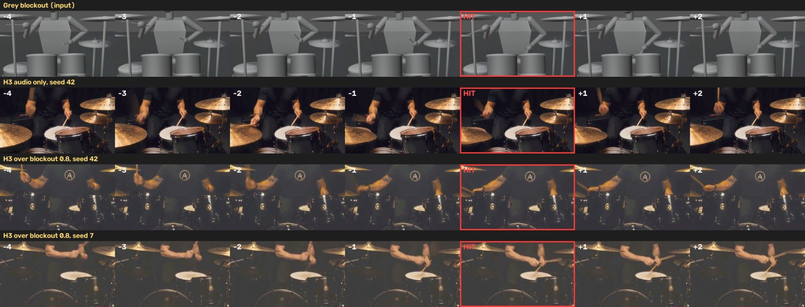
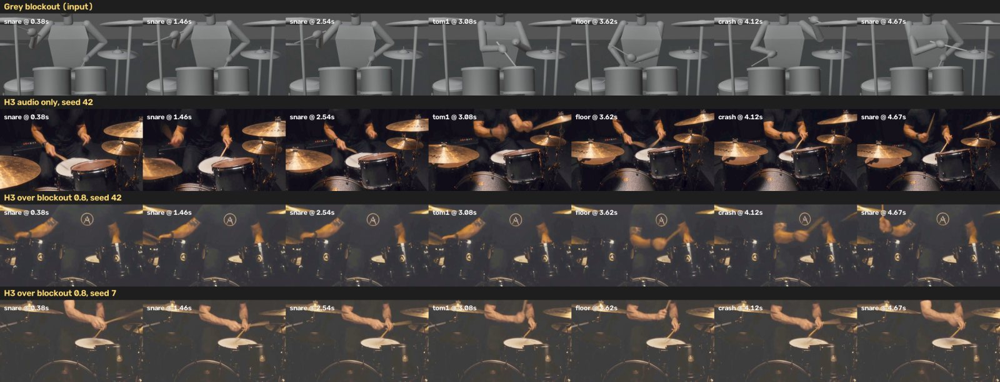
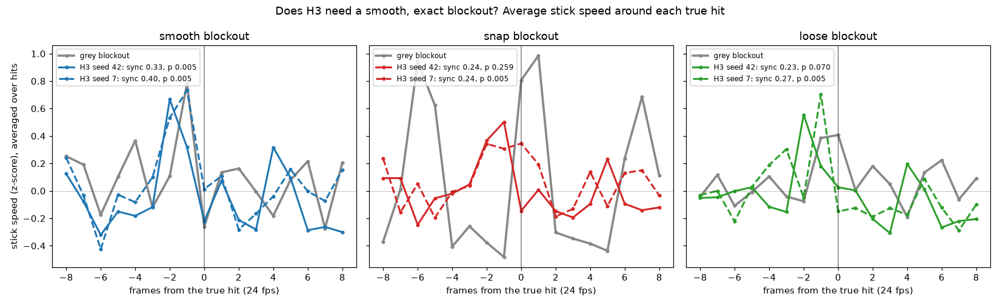
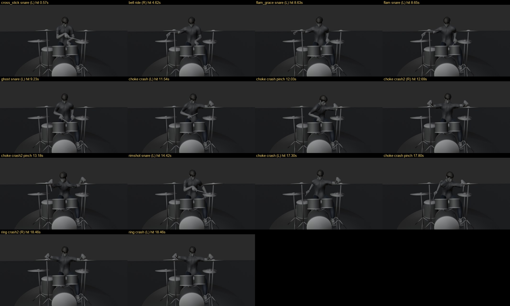
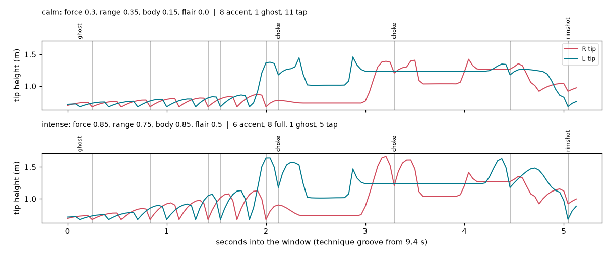
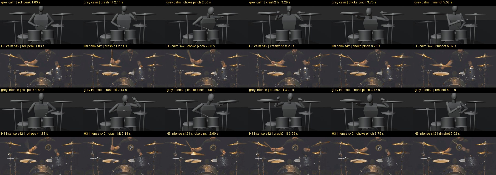
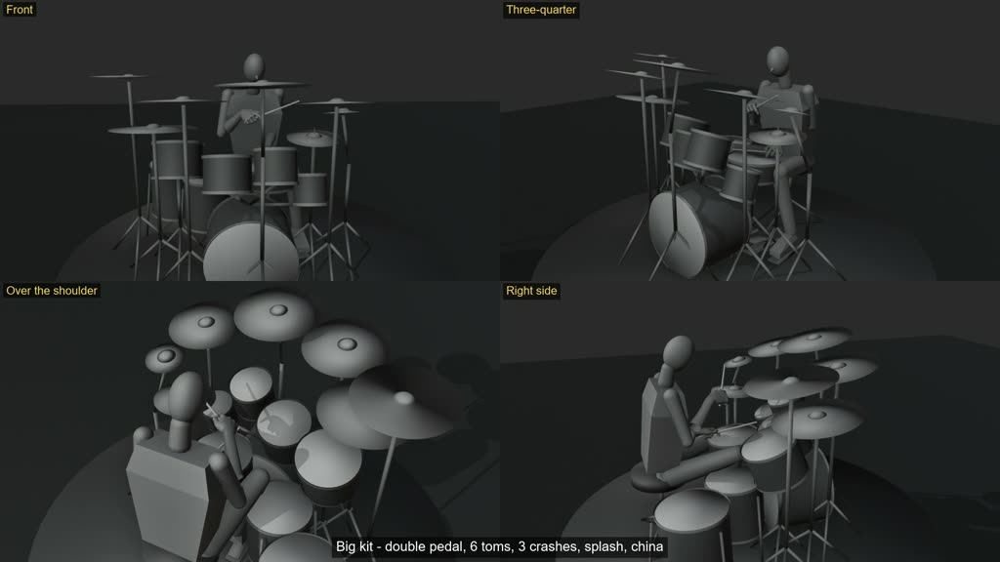
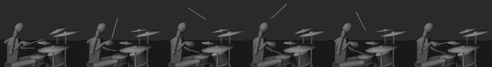

# h3_band_TFCV

Multi-performer music-video shots on **MiniMax H3**: the singer's mouth on the vocal *and* the guitarist's hands on the guitar, in the same shot.

## The problem

H3 generates video and audio jointly, with **one** audio stream and one attention pass over the whole frame. Nothing tells it which sound belongs to which part of the frame. Drive a two-person shot with the full mix and it guesses: everyone sings, or one person performs and the other freezes.

## The approach

1. **Pre-isolate.** Split the song into stems (dry lead vocal, guitar, drums, backing vocals) and define the **zones of action** in the frame (a box per performer).
2. **Isolated runs.** One H3 run per zone. Only that zone regenerates, driven by **its own stem** frozen into H3's audio stream. Everything outside the zone is locked to the previous take.
3. **Merge.** A low-denoise pass over the whole frame under the full mix, to settle the seams.

```
song.wav ──separate──▶ vocals_dry / guitar / drums / backing
                              │
shot spec (zones) ──preflight──▶ cut stems + jobs ──run_chain──▶ base → zone A → zone B → merge
                                                                    (each take scored per zone)
```

## How the lock works (per-token noise masks)

`comfy_nodes/h3_band_zone_latent.py` (**H3 Band Zone Latent**) writes per-stream noise masks onto the AV latent:

- **mask 0**: the token is fed in clean at the condition timestep and pinned to that content to the end. With `audio_denoise=0`, the stem is in H3's audio stream, clean, from the very first step.
- **mask 1**: generated from scratch.
- **fractional mask m**: the token runs at m·σ, which is partial re-noise.

An isolated run is `mode B` + `video_denoise 0` (the take is locked) + a zone box at `zone_denoise`.

**Zone sizing, what we've seen so far:**
- A lip sync works with a head box at about **0.92**, because a mouth moves a few pixels.
- Instrument motion did **not** appear at 0.92. Because of H3's sigma shift, 0.92 leaves the region about half-noised, so the pose survives and only the texture changes.
- At **1.0** with a box over only the lower body and the instrument body, the performer was regenerated but still didn't strum. The locked guitar neck and raised arm above the box pinned the pose.
- At **1.0** with a box over the **whole performer and the whole instrument**, plus a prompt that describes playing instead of posing, the guitarist **plays**: the picking arm moves with motion blur. The strokes are **not on the beat**.
- Adding drums under the guitar in the audio stream, or a "hard strum on every beat" prompt, didn't change that.
- **The prompt sets the amount of motion.** "Hard, on every beat" gives big swings; "small, tight strokes, fretting hand slides, gentle sway" gives a calmer performance. It doesn't set the timing.
- **Retiming an H3 take onto the onsets** (time-warping the zone with DTW so its stroke peaks land on the onsets) failed: the generated strokes weren't distinct enough to align.
- **Conclusion:** H3 doesn't place a strum or a key press on a specific onset from the audio alone. Its video tokens span 4 frames, finer than a 16th-note strum, and nothing ties a background performer's hand to the stem. Timing has to be in the pixels before H3 sees them, which is what `blockout/` does (below).

## Setup

**Not included:** ComfyUI, the MiniMax H3 weights, separator checkpoints, the face landmark model, and any input media.

1. **ComfyUI with MiniMax H3 support and per-token noise masks on nested AV latents** (upstream ComfyUI PR #15375). Without that PR the zone latent still loads, but the sampler applies its masks as inpaint blending, a looser lock. Copy `comfy_nodes/h3_band_zone_latent.py` into `ComfyUI/custom_nodes/`. H3 file names default to the values in `h3band/config.py` (`H3B_UNET`, `H3B_CLIP`, `H3B_VAE`, `H3B_AUDIO_VAE`).
2. **Two venvs.** They're kept separate because mediapipe and torch pins fight.
   ```bash
   python3 -m venv .venv_score && .venv_score/bin/pip install -r requirements-score.txt
   python3 -m venv .venv_sep   && .venv_sep/bin/pip install torch torchaudio --index-url https://download.pytorch.org/whl/cpu \
                               && .venv_sep/bin/pip install -r requirements-sep.txt
   ```
3. **Face model** for `sync_score.py`:
   ```bash
   mkdir -p models && curl -L -o models/face_landmarker.task \
     https://storage.googleapis.com/mediapipe-models/face_landmarker/face_landmarker/float16/1/face_landmarker.task
   ```
4. **Paths.** Everything is set by env vars (see `h3band/config.py`):

   | var | default | what |
   |---|---|---|
   | `H3B_WORK` | `./work` | working dir |
   | `H3B_SONG` | `work/song/mix.wav` | full mix |
   | `H3B_BEATS` | `work/song/beats.json` | `{"beats": [s, ...]}` |
   | `H3B_STEMS_DIR` | `work/stems` | `vocals_dry.wav guitar.wav drums.wav backing.wav bass.wav mix.wav` |
   | `H3B_GUITAR_EVENTS` | `work/guitar_events.json` | output of `guitar_events.py` |
   | `H3B_COMFY_URL` | `http://127.0.0.1:8188` | ComfyUI API |
   | `H3B_COMFY_INPUT` / `H3B_COMFY_OUTPUT` | `./ComfyUI/input` / `output` | ComfyUI dirs |
   | `H3B_MODEL_DIR` | `./models` | audio-separator checkpoints |
   | `H3B_FACE_MODEL` | `models/face_landmarker.task` | mediapipe model |

## Workflow

```bash
cd h3band
# 1. stems: separate from the mix, or drop generator stem exports (e.g. Suno) into $H3B_STEMS_DIR under the generic names
../.venv_sep/bin/python separate.py                        # vocal -> dry vocal, 6-stem split
../.venv_sep/bin/python stem_quality.py q.json dry=$H3B_STEMS_DIR/vocals_dry.wav gtr=$H3B_STEMS_DIR/guitar.wav --ref dry
# 2. pattern identifiers
../.venv_sep/bin/python guitar_events.py $H3B_STEMS_DIR/guitar.wav $H3B_BEATS $H3B_GUITAR_EVENTS --drums $H3B_STEMS_DIR/drums.wav
../.venv_sep/bin/python align_lyrics.py $H3B_STEMS_DIR/vocals_dry.wav lyrics.json align.json      # optional
../.venv_sep/bin/python vocal_activity.py $H3B_STEMS_DIR/vocals_dry.wav va.json --align align.json  # optional
# 3. pre-flight a shot (cuts stems, checks zones, writes jobs)
../.venv_score/bin/python shot_preflight.py ../examples/shot_example.json
# 4. run the chain (needs ComfyUI up)
../.venv_score/bin/python run_chain.py demo_duo --dry-run
../.venv_score/bin/python run_chain.py demo_duo
```

**Choosing a lead vocal.** Use the stem with real silence between phrases: high per-5-s dynamic range and a high silent fraction in `stem_quality.py`. A reverb-washed or doubled vocal never goes quiet, so the mouth never closes. A de-reverb pass on a separated vocal often beats a generator's own vocal stem, which can keep doubles and gang vocals.

**Starting from an existing take.** Put `"plate": "<input-relative mp4>"` in the spec. The base run is skipped and the first zone run locks to that take. Mind any preroll: `song_start` is where the *render's* frame 0 sits in the song.

## Scorers (each with its own control)

- **`sync_score.py VIDEO AUDIO --box x0,y0,x1,y1`**: mediapipe FaceLandmarker `jawOpen` (plus the inner-lip gap) against the vocal envelope (150–4000 Hz RMS dB). It reports:
  - peak cross-correlation and its lag over ±8 frames
  - correlation at lag 0
  - closed-mouth-in-silence and open-mouth-in-voice rates
  - the fraction of frames with no face found.

  Use `--shift S` for a time-shifted audio control. `jawOpen` is the signal that separates real audio from the control; the lip gap doesn't. Small or mic-occluded faces use a tiled search plus a tracked upscaled crop.
- **`strum_score.py VIDEO EVENTS SONG_START --box ...`** (v1): Farneback optical-flow magnitude in the box (detrended) against the guitar onset train, with the onsets shifted by 1, 2 and 3 s as controls. Body bounce and camera moves swamp it; use v2.
- **`strum_score2.py VIDEO EVENTS SONG_START --box ... [--beats BEATS] [--grid-lag S]`** (v2): the picking-stroke signal. It uses MediaPipe hand landmarks when a hand is found in at least half the frames. Otherwise it takes optical flow with the zone's median motion removed (bounce, push-in) and picks the 3x3-cell sub-box with the most motion above 3 Hz. It scores stroke speed against the onset train, with controls (onsets shifted 1/2/3 s, another song section) and a permutation p-value over 200 circular shifts. `sync_margin` = real minus the best control.
  - Validation: a synthetic onset-locked jolt under a ±25 px random-walk body bounce scores +0.59 (p 0.005), where v1 reads 0.00. A static plate scores −0.09.
  - **Pass a tight `--box` around the picking hand and check the reported `subbox`.** Given a whole-performer zone, the sub-box search once locked onto drifting stage smoke beside the guitarist and reported a false "in sync" (+0.10, p 0.005).
  - At 24 fps a 16th note is about 3 frames, so beat-phase locking (metric `b`) can't separate synced from static; it's reported but not used.
- **`drum_sync_score.py VIDEO HITS.json START [--box ...]`**: stick speed (`strum_score2`'s sub-box flow signal) against the hand hits (kick and hi-hat pedal dropped) within ±2 frames. Controls: the hits shifted by half their median gap (between the hits) and by 1/2/3 s, plus a 200-shift permutation p-value. strum_score2's ±4-frame search let shifted controls slide back onto an 8th-note groove.

## Known limits

- **Video tokens are about 4 frames long.** H3's latent frames cover 1, 4, 4, 4, 4 pixel frames per 17-frame clip, and a token is 32 px. 16th-note strums are finer than one video token, so strum timing has to come through the 40 Hz audio tokens.
- **The lyric aligner is weak on sung vocals.** torchaudio MMS_FA is speech-trained: expect about ±0.5 s on half the words, and character spans rather than phonemes. Vocal activity leans on dry-vocal energy.
- **Stroke direction** (down vs up, from low-vs-high band rise timing) is a weak signal; treat individual calls as unreliable.
- **One shared audio stream per run.** The zone runs work around this by freezing one stem per run; they don't solve it.

## Instrument blockouts (`blockout/`)

Zone runs gave lip sync, but not instruments: H3 doesn't learn a strum or a key press from the audio alone. H3 *is* good at painting over grey 3D blockouts. So we animate primitive performers playing the actual notes, render grey footage, and let H3 re-skin it with the stem locked in its audio stream. The timing is in the pixels.

| file | what |
|---|---|
| `midi.py` | MIDI reader (notes in seconds, beat/downbeat grid from the time signature). No dependencies. |
| `feeling.py` | Feeling chart → performance: per-bar strength, touch (caress..strike), freedom, tempo (rubato) and head style, plus phrase breathing, voicing and seeded per-note variation. |
| `piano.py` | Fingering (Viterbi, Parncutt-style costs), hand glide, per-touch strike/press/release, arm weight, phrase "breaths", finger IK, key travel. Collision: the keyboard is a heightfield (white keys, raised black keys, pressed keys lowered, rail, fallboard); finger pads sit on it by their radius, every finger segment is lifted out of it, and pressing fingers pull the hand within reach. Each run reports `qa`: finger-frames inside a key, strikes in the hit pad, crossed fingers, and `reach` (pressing fingertips that don't get to their key). Plain numpy. |
| `dynamics.py` | Second-order springs (frequency, damping, response) that every motion target runs through: anticipation, overshoot, follow-through. |
| `suite.py` | Splices an original theme and excerpts into one MIDI on bar boundaries, with a per-bar tempo map (the Knight's Suite). |
| `cameras.py` | Music-driven camera edit: cuts on downbeats (on beats at the climax), shot length and shot choice follow the energy (wide, first-person, orbit, hand tracking, close-ups, overhead, low hero angle, grazing keyboard, closing pull-back), operator-smoothed tracking. Render with `--view edit`. |
| `performer.py` | Shared body: torso, neck, head, 2-bone arm IK, and head styles driven by the beat grid (`focused`, `groove`, `wild`, `crowd`, `expressive`). |
| `blender_piano.py` | Blender renderer: grey 88-key piano, capsule performer, `pov` (camera rides the eyes), `three4`, `side`, `edit` views. `--hands mpfb` (default): a real rigged, skinned CC0 hand from MPFB2 on the primitive wrists, each bone posed from the joints (wrist, metacarpals, MCP/PIP/DIP; thumb CMC/MCP/IP). `--hands capsule`: the mannequin. `--hands skin`: a Skin-modifier tube stopgap. |
| `hand_model/` | `mpfb_make_hand.py` makes the hand (Blender 4.2+ with the MPFB2 extension, run on an x86-64 box). `mpfb_hands.blend` is the skinned hands and rig. `mpfb_hands.json` has the rest bones and measured finger radii. `piano.py --hand mpfb` (default) takes its segment lengths, knuckle layout, palm length and radii from this file, and solves the thumb with joint limits (CMC cone, MCP/IP hinges). MPFB2 code is GPL-3.0; the generated meshes are CC0. |
| `sampler.py` | Sampled grand piano (SFZ+FLAC) with automatic pedal and room reverb. |
| `synth.py` | Dependency-free additive piano, for quick timing checks. |
| `drums.py` | Sticking (beam search over hand preference, travel and crossing), velocity-scaled strokes landing on the onset frame, sprung wrists, kick and hi-hat pedals with leg IK, double pedal. With physics on (the default): hitboxes, cymbals as damped oscillators, per-surface rebound and head give. Plain numpy. Reads a GM drum MIDI or a hit list from `h3band/drum_events.py`. |
| `drum_kit.py` | Kits as data: presets (`standard`, `double_pedal`, `big`) or a typed spec of pieces by type and size, laid out by rule around the seat and nudged until nothing clashes and every piece is in reach. |
| `drum_hands.py` | The piano's rigged MPFB2 hand (`blockout/rig`) holding a stick. The grip is solved once per side: the stick runs under the palm from the heel to the index finger, fingers 2-5 close on it until each bone touches, and the thumb presses at the fulcrum. Gives the wrist the arm reaches for, the fist hitbox, wrist bend and strain costs for the arm planner, and an open hand for the stick toss. |
| `drum_collide.py` | Signed-distance hitboxes for the kit, stands and drummer. Moves sticks, fists and elbows out of anything they are not playing, including the other hand's stick and arm, and reports any clip left (`python -m blockout.drum_collide ANIM.json`). |
| `drum_toss.py` | Stick toss and catch: the hand flicks the stick up, it flies on a ballistic arc turning end over end, and lands back in the hand. |
| `blender_drums.py` | Blender renderer: grey kit and capsule drummer with the skinned MPFB2 hands posed from `drum_hands.py` (older JSONs get a fist), `front`, `three4`, `side`, `over`, `top` views, or `--cam` for any eye and look-at point. |
| `drum_style.py` | Drummer emotion: `force`, `range`, `body`, `flair` sliders, the `calm` / `groove` / `intense` / `showy` presets built from them, and a timeline that crossfades between presets. Sets stroke heights, arm lift, torso lean and cymbal follow-through. |
| `drum_teacher.py` | Technique teacher: reads the hits in their musical context and picks chokes, rimshots, cross-sticks, ride bell, flams and ghost notes, with the reason for each. `drums.py` plays them. |
| `drum_groove.py` | Writes the original example grooves (`examples/drums/rock_groove.mid`, `technique_groove.mid` with `--song technique`, a 30 s big-kit piece with `--song showcase`, a gap for a stick toss with `--song toss`). |
| `drumsynth.py` | Numpy drum synth: a hit list to a WAV, for timing checks and as ground truth for `drum_events.py`. Sounds the techniques too (a choked crash stops dead). |

```bash
python3 -m venv .venv_blockout && .venv_blockout/bin/pip install -r requirements-blockout.txt
mkdir -p work                                            # the commands below write here
# piano samples (Salamander Grand Piano V3, CC-BY 3.0, Alexander Holm), into models/:
#   https://freepats.zenvoid.org/Piano/acoustic-grand-piano.html  (SFZ+FLAC)
P=.venv_blockout/bin/python
$P -m blockout.piano examples/piano/clair_de_lune.mid work/cdl.json \
   --feeling examples/piano/clair_de_lune.feeling.json --notes-out work/cdl_notes.json
blender -b --factory-startup -P blockout/blender_piano.py -- work/cdl.json work/frames --view three4
$P -m blockout.sampler work/cdl_notes.json work/cdl.wav --sfz models/.../SalamanderGrandPiano-V3+20200602.sfz
```

**Drums.** From a GM drum MIDI, or from a drum stem through `h3band/drum_events.py`:

```bash
$P -m blockout.drums examples/drums/rock_groove.mid work/drums.json --hits-out work/drum_hits.json \
   --schedule 0:focused,8:groove,24:wild
$P -m blockout.drumsynth work/drum_hits.json work/drums.wav            # timing reference audio
blender -b --factory-startup -P blockout/blender_drums.py -- work/drums.json work/drum_frames --view front
# or from a real stem (beats JSON optional; it drives the head styles):
(cd h3band && ../$P drum_events.py $H3B_STEMS_DIR/drums.wav ../work/drum_events.json)
$P -m blockout.drums work/drum_events.json work/drums.json --beats $H3B_BEATS
```

`drums.py` prints a check after every run: stick-tip contact error on the onset frames (about 0.1 mm max on the example), frames where a tip goes through a head (0), kicks with the beater on the head on their onset frame (all), and the furthest reach against the arm length. `--clips` adds the hitbox report (frames where a stick, fist or arm goes into something it isn't playing). `--kit` plays on another kit and `--toss` adds stick tosses; see [Drum kits, physics and stick tosses](#drum-kits-physics-and-stick-tosses).

`drum_events.py` is a band-energy heuristic, not a transcriber. Pass `--truth HITS.json` to score it against a known hit list: render a MIDI through `drums.py --hits-out` and `drumsynth.py`, then detect on the WAV. On the synthesized example grooves it finds kick, snare, hi-hat and crash at about 0.7–0.9 recall and 0.9–1.0 precision. Ride hits come out at about 0.6 and toms are unreliable. The numbers for each piece are in the module docstring. A real mixed stem will score lower, so check the hit list before rendering a long take.

Example MIDIs from the Mutopia Project: Clair de Lune, Rondo alla Turca and Brahms Op. 118 No. 2 are Public Domain; Rachmaninoff Op. 3 No. 2 is CC BY-SA 4.0. `knights_suite.mid` (built by `suite.py`) contains an original theme plus excerpts of the Rachmaninoff (CC BY-SA 4.0) and the Brahms.

## Drum blockout in ComfyUI, driven by the Comfy SDK

`comfy_nodes/h3_band_drums.py` puts the drum blockout in a ComfyUI graph:

| node | in | out |
|---|---|---|
| **H3 Band Drum Events** | `AUDIO` (a drum stem) | `DRUM_HITS` from `h3band/drum_events.py` |
| **H3 Band Drum Hits (MIDI)** | a GM drum `.mid` in the input dir | `DRUM_HITS` with the MIDI's beat grid |
| **H3 Band Drum Teacher** | `DRUM_HITS`, `choke_gap` (beats of silence that make a loud crash a choke) | `DRUM_HITS` with techniques, and the lesson sheet as a `STRING` |
| **H3 Band Drum Kit** | a preset, or a kit spec typed as JSON (prose and code fences around it are fine) | `DRUM_KIT` from `blockout/drum_kit.py`, and a report `STRING` (what the parser changed, each piece, the clash and reach check) |
| **H3 Band Drum Synth** | `DRUM_HITS`, seed, optional `DRUM_KIT` | `AUDIO`: `blockout/drumsynth.py`, techniques included, tuned and panned by the kit |
| **H3 Band Drum Blockout** | `DRUM_HITS`, `start` (s), `frames`, `fps`, size, view or `camera`, head schedule, `motion` (smooth / snap / loose), `emotion` timeline, `force` / `range` / `body` / `flair` overrides, optional `DRUM_KIT`, `tosses` | `IMAGE`: grey kit frames from `blockout/drums.py`, rendered by Blender; a report `STRING` (contact check, tiers, tosses, lesson) |

The frames begin at `start` seconds into the hits, so `TrimAudioDuration` (start = `start`, duration = frames / fps) gives the matching audio for `CreateVideo`. The same frames can be VAE-encoded as the take for an H3 zone run. `examples/workflows/drum_blockout_api.json` is the stem → hits → blockout → MP4 graph in API format.

`h3band/sdk_drum_blockout.py` runs that graph through the official [Comfy SDK](https://docs.comfy.org/development/api-development/sdks) (`comfy-sdk`, MIT). It uploads the stem or MIDI as an asset, sets the inputs, follows the job's progress events and downloads the video:

```bash
# ComfyUI side: the nodes import blockout/ and h3band/ from this repo, so link the folder rather than copy the file
#   (a copied folder works too with H3B_REPO=<repo>). It also loads H3 Band Zone Latent when the ComfyUI supports it.
ln -s "$PWD/comfy_nodes" ComfyUI/custom_nodes/h3band     # Windows: mklink /J ComfyUI\custom_nodes\h3band comfy_nodes
ComfyUI/.venv/bin/pip install soundfile                 # numpy, scipy and Pillow ship with ComfyUI
export H3B_BLENDER=/path/to/blender                     # default: blender on PATH
python ComfyUI/main.py --port 8188 &

# client side: the SDK talks Comfy API v2, which a self-hosted ComfyUI serves through comfy-api-proxy
python3 -m venv .venv_sdk && .venv_sdk/bin/pip install -r requirements-sdk.txt
.venv_sdk/bin/comfy-api-proxy run --comfyui http://127.0.0.1:8188 --port 8189 &
cd h3band
../.venv_sdk/bin/python sdk_drum_blockout.py $H3B_STEMS_DIR/drums.wav ../work/drums_blockout.mp4 --start 8 --frames 121
../.venv_sdk/bin/python sdk_drum_blockout.py ../examples/drums/rock_groove.mid ../work/groove.mp4 \
    --audio ../work/drums.wav --view three4 --heads 0:wild      # MIDI hits, a drumsynth render as the soundtrack
```

`COMFY_BASE_URL` picks the server (default `http://127.0.0.1:8189`). On an RTX 5060 Ti, 121 frames at 1280x704 (Workbench) take about 17 s on the server, including detection. The node loads every frame into one `IMAGE` batch (about 10 MB per 1280x704 frame), so render long takes in sections.

### H3 over the drum blockout

`h3band/sdk_drum_h3.py` builds the whole H3 graph and runs it through the same SDK path. The drum stem is trimmed to the window and frozen in H3's audio stream by H3 Band Zone Latent (`audio_denoise` 0). With `--blockout`, the grey frames from H3 Band Drum Blockout are VAE-encoded as the starting video latent and sampled over the last `--steps` of `round(steps / denoise)` steps. `--no-blockout` starts the video from noise: what H3 does from the audio alone. The stack is the lab's turbo graph: w4a8 fl2va DiT, Turbo v4 LoRA + Turbo Sampler (8 steps), realism LoRA, sigma shift 12/3, 1280x736, 124 frames.

```bash
cd h3band
../.venv_sdk/bin/python sdk_drum_h3.py ../work/C.mp4 --midi ../examples/drums/rock_groove.mid --audio ../work/drums.wav \
    --blockout --denoise 0.8 --start 13
../.venv_sdk/bin/python sdk_drum_h3.py ../work/B.mp4 --midi ../examples/drums/rock_groove.mid --audio ../work/drums.wav \
    --no-blockout --start 13
python drum_sync_score.py ../work/C.mp4 ../work/drum_hits.json 13      # in an env with opencv + mediapipe
```

Results on the example groove, 13.0–18.2 s (the fill into the next section), same prompt and audio for every take, seed 42 unless noted, about 6.5 min each on an RTX 5060 Ti:

| take | stick sync | best control | margin | p | look |
|---|---|---|---|---|---|
| A: grey blockout | 0.331 | 0.185 | +0.146 | 0.005 | grey capsule drummer |
| B: H3, audio only | 0.076 | 0.149 | −0.073 | 0.80 | real drummer, H3 picks its own close-up framing |
| C: over blockout, denoise 0.6 (8 of 13 steps) | 0.308 | 0.156 | +0.152 | 0.05 | real drummer, the kit stays matte grey |
| C: over blockout, denoise 0.8 (8 of 10) | 0.325 | 0.194 | +0.131 | 0.005 | real drummer and kit, the blockout's framing |
| C: over blockout, denoise 0.89 (8 of 9) | 0.124 | 0.167 | −0.043 | 0.24 | real drummer, framing drifts, timing gone |
| B, seed 7 | 0.034 | 0.172 | −0.139 | 0.73 | real drummer |
| C at 0.8, seed 7 | 0.401 | 0.135 | +0.266 | 0.005 | real drummer and kit, the blockout's framing |

From the audio alone H3 paints a convincing drummer whose sticks don't follow the hits. Over the blockout at 0.6–0.8 the sticks keep the blockout's timing, about as well as the blockout itself, and 0.8 is the first strength where the kit no longer looks grey. At 0.89 the blockout is too faint to hold either the timing or the camera. ComfyUI's `BasicScheduler` floors `steps / denoise`, so 8 steps at denoise 0.9 there is the full schedule from noise. That take came out as the same video as B, which is why the script splits the sigmas itself.

One snare backbeat (1.46 s into the window), frame by frame from 4 frames before the hit to 2 after, cropped to the hands and brightened. Over the blockout, seed 7's right stick is up at −4 and on the snare at the hit. Seed 42's arm comes down on the hit but is motion-blurred. With audio only, the stick is mid-stroke at the hit:



The frame at each big hit in the window. The blockout moves to the toms (3.08 s, 3.62 s) and reaches for the crash (4.12 s):



**Limitation: the timing of the strokes transfers, but not which drum they land on.** Through the fill, the seed 7 drummer keeps playing the snare in time while the blockout moves around the toms, and seed 42 is a blur. `drum_sync_score.py` measures stroke timing only, so it doesn't see this. Getting limb placement to carry over probably needs a lower denoise in the fill or a stronger blockout (thicker sticks, contrasting drum heads); neither has been tried.

`drum_sync_score.py` only separates synced from unsynced on varied playing. On the steady 8th-note groove (8.0–13.2 s) the blockout itself fails its between-hits control (margin −0.02), so score fills and breaks. All of these takes use the `drumsynth.py` render of the MIDI; H3 over a blockout driven by a real drum stem hasn't been scored yet.

#### How exact does the blockout have to be?

`--motion` (and the node's `motion` input) swaps the blockout's stroke motion, everything else held fixed:

- `smooth`: the rules in `blockout/drums.py`. Eased strokes, springs on the hands, tips on the head on the hit frame.
- `snap`: two poses with no easing and no springs. The tip is on the head on the hit frame and at the next stroke's prep height on every other frame.
- `loose`: smooth, but every hand hit lands up to 2 frames (83 ms) early or late and up to 8 cm off its strike point.

```bash
../.venv_sdk/bin/python sdk_drum_h3.py ../work/snap.mp4 --midi ../examples/drums/rock_groove.mid --audio ../work/drums.wav \
    --blockout --denoise 0.8 --start 13 --motion snap
```

Same window, prompt and audio as above, denoise 0.8, scored against the true hit times:

| blockout | grey blockout: sync / margin / p | H3, seed 42 | H3, seed 7 |
|---|---|---|---|
| smooth | 0.331 / +0.146 / 0.005 | 0.325 / +0.131 / 0.005 | 0.401 / +0.266 / 0.005 |
| snap | 0.575 / +0.051 / 0.005 | 0.239 / −0.046 / 0.26 | 0.243 / +0.017 / 0.005 |
| loose | 0.255 / −0.018 / 0.005 | 0.234 / +0.100 / 0.07 | 0.267 / +0.156 / 0.005 |



- **The timing doesn't have to be exact.** With hits up to 2 frames off and aimed up to 8 cm wide, H3 still puts its strokes on the true hits (margins +0.10 and +0.16), at some cost in sync (0.23–0.27 against 0.33–0.40 for smooth). That margin is better than the loose blockout's own, so H3 seems to pull the strokes back toward the locked audio. This is two seeds, so treat it as a lead rather than a result.
- **The motion has to be smooth.** The snap blockout scores highest of the three as grey footage, but H3 drops most of it (margins −0.05 and +0.02). Its hit pose lasts one frame and H3's video tokens span 4, which is a likely reason the jump doesn't survive the encode.

So a blockout needs strokes that move continuously over several frames and land roughly on the beat. Exact timing and exact placement buy little.

### Drum performance: emotion, force and technique

The same hits can be played gently or hard, and some need a specific technique rather than a plain stroke. Two modules control this, and the defaults are unchanged (the rock groove animates byte-for-byte as before).

**Emotion and force** (`blockout/drum_style.py`). Four sliders, 0 to 1:

| slider | what it changes |
|---|---|
| `force` | stroke height, and how much of the arm drives it |
| `range` | dynamic range: how far apart a ghost note and an accent look (0 plays every stroke alike) |
| `body` | how far the torso leans into big strokes, on top of the head style |
| `flair` | how high the stick follows through after a crash |

Presets combine them with a head style from `performer.py`: `calm` (0.30 / 0.35 / 0.15 / 0.00, head `focused`), `groove` (the neutral player), `intense` (0.85 / 0.75 / 0.85 / 0.50, head `wild`) and `showy` (0.75 / 0.90 / 0.70 / 1.00, head `crowd`). A timeline such as `0:calm,8:intense,16:showy` crossfades between them over 0.6 s, and any slider can be overridden for all presets. Every stroke gets a tier from its height: `ghost` and `tap` are wrist strokes, `accent` brings in the forearm and `full` lifts the whole arm. The arm lift and torso lean scale with the tier.

**Technique teacher** (`blockout/drum_teacher.py`). It reads each hit in context and writes down the technique and the reason:

| technique | when | what the blockout does |
|---|---|---|
| choke | a loud crash followed by at least a beat with no hand or kick hits | a free hand reaches the cymbal edge half a beat later and pinches it; the cymbal stops swinging (and the synth cuts the sound) |
| ring | a loud crash that is the last hit of the song | nothing extra: the cymbal is left to ring |
| rimshot | a snare at velocity 112 or more on beat 2 or 4 | the stick comes in flatter, so the tip lands on the head and the shaft on the hoop |
| cross-stick | GM side stick (note 37) | the stick lies across the snare and its far end clicks the rim |
| bell | GM ride bell (note 53) | the tip comes down steeply on the ride's bell |
| flam | a soft hit 12–50 ms before a louder one on the same drum | the grace note is a low stroke from the other hand |
| ghost | a snare under velocity 50 | a wrist stroke a few centimetres off the head |

These are fixed rules rather than a learned model, so every choice can be explained. The lesson sheet is printed by `drums.py --teach` and returned by the Teacher and Blockout nodes. This is the window used below:

```
   time  bar  beat  piece   hand technique    why
   9.52    5  1.50  snare   L    ghost        soft snare: wrist only, tip a few cm off the head
  11.54    6  1.00  crash   L    choke        the band stops for 2.0 beats: pinch the edge 0.5 beats after the hit to cut it off
  12.69    6  2.99  crash2  R    choke        the band stops for 2.0 beats: pinch the edge 0.5 beats after the hit to cut it off
  14.42    7  2.00  snare   L    rimshot      loud backbeat on 2: tip and shaft hit head and hoop together
```

`examples/drums/technique_groove.mid` is a 9-bar study with one technique per bar (side-stick backbeats, ride bell, a flam, ghost notes, two choked crashes into stops, rimshot backbeats, another choke and a ringing last crash). The teacher finds all of them: 4 cross-sticks, 8 bells, 1 flam, 3 ghosts, 3 chokes, 2 rimshots and 2 ringing crashes. With every preset, the blockout check reports no tip going through a head and a furthest reach of 0.548 m against a 0.55 m arm.

```bash
$P -m blockout.drums examples/drums/technique_groove.mid work/tech.json --teach --emotion 0:calm,9:intense \
   --hits-out work/tech_hits.json                    # --force / --range / --body / --flair override the presets
$P -m blockout.drumsynth work/tech_hits.json work/tech.wav
cd h3band   # the same through the SDK; without --audio, H3 Band Drum Synth renders the MIDI in the graph
../.venv_sdk/bin/python sdk_drum_h3.py ../work/tech_intense.mp4 --midi ../examples/drums/technique_groove.mid \
    --teach --emotion 0:intense --blockout --denoise 0.8 --start 9.4
```

The grey blockout at each technique (full groove, `groove` preset, front view):



Stick-tip height over the H3 window for `calm` and `intense`. Calm keeps the crescendo roll in taps and accents. Intense builds it to full-arm strokes and follows through higher after each crash:



#### H3 over the technique blockout

One round: the window above (9.4–14.6 s, 124 frames), `--teach`, presets `calm` and `intense`, denoise 0.8, seeds 42 and 7, the same prompt and synth audio for every take, about 9 min each on an RTX 5060 Ti. Stroke size is the mean and 90th-percentile optical-flow speed in the stick area (camera motion removed, px per frame at 360 px):

| take | calm: mean / p90 | intense: mean / p90 | intense / calm (mean) |
|---|---|---|---|
| grey blockout | 0.724 / 1.823 | 1.341 / 2.574 | 1.85x |
| H3, seed 42 | 0.674 / 1.026 | 0.971 / 1.582 | 1.44x |
| H3, seed 7 | 0.326 / 0.591 | 0.295 / 0.490 | 0.90x |

The grey blockout, then the seed 42 take, at the roll peak, both crash hits, both choke pinches and the rimshot (`calm` on top, `intense` below):



- **Force carries over on one seed out of two.** Seed 42 keeps the blockout's framing, and its intense take plays bigger strokes than its calm one (1.44x, against 1.85x in the grey). The stick goes well above the cymbals on both crash hits. Seed 7 reframes to a side view at the kit level, mostly drops the blockout's arms, and plays both presets at the same size.
- **The choke doesn't carry over.** On the pinch frames the H3 hand is a motion blur near the cymbal, not a hand holding its edge. A pinch is a small, still pose next to big strokes, and H3 smooths it away. It probably needs a lower denoise around the choke, or a blockout hand that stays on the cymbal longer.
- **Rimshot, ghost and cross-stick differ from a plain stroke by a stick angle or a few centimetres.** At this resolution they can't be told apart in the H3 frames, so these results don't show whether they transfer.
- **No timing claim for this window.** It starts with a dense 16th-note roll, and `drum_sync_score.py` scores the grey blockout itself below its control here (margin −0.36 calm, −0.39 intense). The H3 margins (−0.04 to −0.17) can't be read either way. The fill window above is still the timing result.

So the sliders change how hard the blockout drummer plays, and H3 follows that when it keeps the blockout's camera. The technique teacher works in the blockout: the lesson sheet, the check and the grey frames. Two runs aren't enough to say how often H3 keeps the camera, and the small techniques need a closer camera or a lower denoise before H3 can show them.

### Drum kits, physics and stick tosses

Everything here is rules and geometry, no learned model, so a blockout can be checked frame by frame.

**Physics** (on by default; `--no-physics` turns it off for comparison, and then sticks and arms do go through the kit). The kit, its stands and the drummer are signed-distance hitboxes (`blockout/drum_collide.py`) matching what Blender draws. The hands are the rigged MPFB2 hands from the piano, closed on the sticks (`blockout/drum_hands.py`). Each piece gets a home grip: the hand's turn about the stick is searched for the wrist bend, arm strain and elbow position that cost least, kept clear of the kit at the strike and at the top of the stroke. The hips sit 8 cm behind the point the kits are laid out around, which gives the elbows room beside the torso. A stroke under a hanging cymbal or hi-hat is capped below it. After the strokes are planned, sticks, fists and arms are pushed out of anything they aren't playing. Then each elbow picks the swivel that keeps its forearm off the drums, the torso and the other hand's stick and fist, and a last push cleans up what moved. Hands that meet push each other apart, and a tip held on a head gives less. The hi-hat is one solid (both cymbals and the gap), so a stick can't wedge between them. Cymbals swing as damped oscillators and the next stroke meets them where they are. Each surface has its own rebound, and heads give a little under the tip. On the rock, technique and showcase grooves, on the standard and big kits, the clip report finds 0 clipping frames, with tip contact within 0.1 mm on every onset frame.

**Kits** (`blockout/drum_kit.py`). A kit is a list of pieces by type and size:

```json
{"double_pedal": true, "pieces": [{"type": "tom", "size": 8}, {"type": "tom", "size": 10}, {"type": "floor", "size": 16},
  {"type": "crash", "size": 18}, {"type": "china", "size": 18}, {"type": "ride", "size": 22, "at": [0.63, 0.44, 1.04], "tilt": 10}]}
```

Kick, snare and hi-hat go where the standard kit has them (added if missing). Rack toms go on an arc smallest to largest, floor toms on a second arc to the right, and cymbals at the standard spots, then in fixed slots. Then each piece moves until it clears the kit, its hardware, the air above every head and the stick's path to it, and stays within reach. No cymbal or hi-hat may hang over the column of air a stick rises through above another drum's strike point. A piece can also be placed by hand with `at`. Layouts the rules can't fit (eight rack toms, a floor tom behind the seat) raise an error that says to place them by hand. The typed-spec parser accepts aliases ("bass drum", "floor tom", "Hi-Hat"), sizes like `"14x5.5"`, and prose around the JSON, and reports every change it makes. GM notes are pointed at the kit's pieces: the six GM toms spread over however many toms it has, and 55 / 52 go to its splash and china. The presets are `standard`, `double_pedal` and `big` (double pedal, six toms, three crashes, splash, china, ride).



**Stick toss** (`blockout/drum_toss.py`). `--toss R:4.85:5.55[:spins]` takes the right hand off the kit: it moves to a spot in front of the chest, flicks the stick up, and catches it 0.7 s later. The stick flies as a rigid body on a ballistic arc, turning end over end at the rate the wrist gave it, and lands in the pose the hand holds it in. The wrist gives with the spin at the catch. Strokes near the toss go to the other hand. A toss over strokes that can't move, or two overlapping tosses by one hand, is an error.



```bash
$P -m blockout.drum_groove work/showcase.mid --song showcase
$P -m blockout.drums work/showcase.mid work/show_big.json --kit big --teach --dur 30 --clips --hits-out work/show_hits.json \
   --emotion 0:groove,6.4:calm,12.9:intense,19.3:showy,25.7:intense
$P -m blockout.drumsynth work/show_hits.json work/show_big.wav --dur 30 --kit big
$P -m blockout.drum_groove work/toss.mid --song toss
$P -m blockout.drums work/toss.mid work/toss.json --toss R:4.85:5.55 --clips
$P -m blockout.drum_kit my_kit.json            # lay out a typed kit and print the check
```

## Hackathon tasks

- [ ] **Per-zone audio binding.** Bind each stem to its zone inside one run: multiple audio segments plus an attention bias, so stem A's tokens reach only zone A's video tokens.
- [ ] **Staggered per-zone timesteps.** Give zones their own timestep rows (AdaLN row ids per token). Global structure resolves first, then each zone develops in turn while the other stays noisy as context.
- [ ] **H3 over the piano blockout: the go/no-go.** Run about 5 s of a blockout through H3 at zone strengths 0.6 / 0.75 / 0.9 with the piano audio locked, then score whether each struck key lands on its onset.
- [ ] **Guitar strum blockout.** A grey picking arm and guitar strumming down/up on the onsets from `guitar_events.py`, rendered from the shot's camera, composited over the guitarist zone, then H3 at about 0.85–0.9 with the guitar stem locked.
- [x] **Drum blockout.** Stick tips and pedals on the drum-stem hits or a GM drum MIDI (`blockout/drums.py`, `blockout/blender_drums.py`, `h3band/drum_events.py`).
- [x] **H3 over the drum blockout.** Go: at denoise 0.6–0.8 the sticks keep the blockout's timing (p 0.005 at 0.8), audio alone doesn't (`h3band/sdk_drum_h3.py`, `h3band/drum_sync_score.py`). Which drum each stroke lands on doesn't carry over yet. Strokes have to be smooth but not exact (`--motion`).
- [x] **Drum emotion, force and technique.** Slider presets with crossfades (`blockout/drum_style.py`) and a rule-based technique teacher for chokes, rimshots, cross-stick, bell, flams and ghosts (`blockout/drum_teacher.py`), plus the Teacher and Synth nodes. Over H3, force carries over on one seed out of two, and the choke pinch doesn't carry over yet.
- [x] **Drum kits, physics and stick tosses.** Hitboxes and a clip resolver (`blockout/drum_collide.py`), cymbal dynamics, rebound and head give, kits from presets or typed specs (`blockout/drum_kit.py`, H3 Band Drum Kit node), and a stick toss and catch (`blockout/drum_toss.py`). 0 clipping frames on every example groove.
- [ ] **Bass blockout.** Bass fingers on the bass note onsets.
- [x] **Comfy nodes for the drum blockout.** Drum Events / Drum Hits (MIDI) / Drum Blockout render, driven through the Comfy SDK (`h3band/sdk_drum_blockout.py`).
- [ ] **Comfy nodes for the rest of the chain.** Piano and guitar blockout render nodes, then blockout → H3 Band Zone Latent end to end through the SDK.
- [ ] **A ground-truth strum clip** for `strum_score2.py` (real footage with known stroke times), plus stroke-direction scoring.
- [ ] **Phoneme-level vocal alignment** for sung vocals, giving visemes for the mouth.
- [ ] **Seam handling in the merge pass.** Release a feathered band around touching zones instead of the whole frame.

## License

Code: MIT, see `LICENSE`. Example MIDI files carry their own licenses; see `examples/piano/README.md` and `examples/drums/README.md`.
